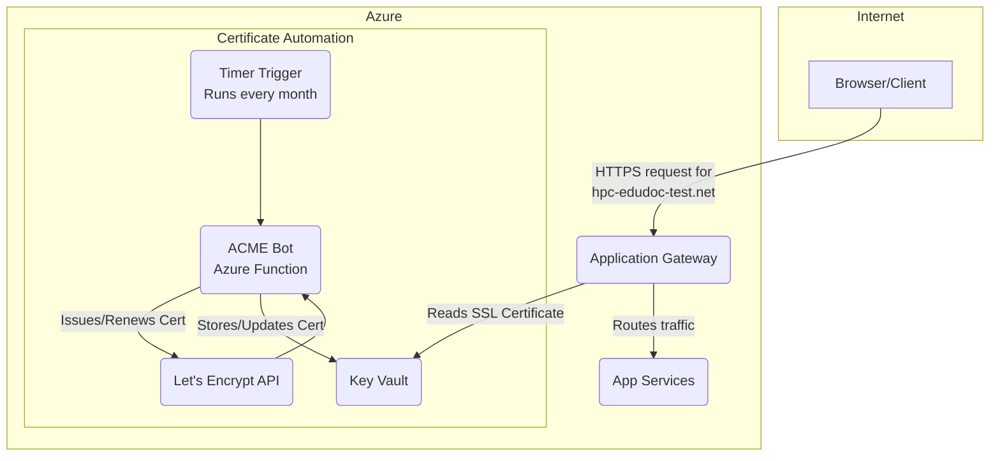

# Automated Let's Encrypt SSL for Application Gateway with Key Vault

## Overview

This document outlines the modern, recommended process for securing an Application Gateway with a free, trusted, and auto-renewing SSL certificate from Let's Encrypt. This guide is based on the official [keyvault-acmebot Getting Started](https://github.com/shibayan/keyvault-acmebot/wiki/Getting-Started) guide.

## Prerequisites

This guide assumes you have already performed the following action:

*   **Purchased a domain via Azure Portal:** You have used the "App Service Domain" feature in Azure to acquire your custom domain (e.g., `hpc-edudoc-test.net`).

When you buy a domain through Azure, it typically creates an Azure DNS Zone for you and automatically configures the domain delegation (nameservers) correctly. The steps below will grant the required permissions for the automation to work.

The certificate will be stored and managed in Azure Key Vault, and the Application Gateway will be configured to use it directly from the vault. This avoids the need to handle `.pfx` files and passwords manually.

### Architecture

The process uses a small, serverless Azure Function that runs on a schedule. This function, called an ACME bot, handles all the interactions with Let's Encrypt and automatically updates the certificate in Key Vault before it expires.



---

## Phase 1: Create Core Resources (Key Vault & Managed Identity)

First, we need a Key Vault to store the certificate and a User-Assigned Managed Identity to grant the Application Gateway secure access to it.

```powershell
# Set variables
$resourceGroup = "rg-test-eastus2-EduDoc"
$location = "eastus2"
$keyVaultName = "kv-edudoc-test-$((New-Guid).ToString().Substring(0,8))" # Must be globally unique
$identityName = "id-appgateway-test"

# Create a new Azure Key Vault
az keyvault create --name $keyVaultName --resource-group $resourceGroup --location $location --enable-rbac-authorization false

# Create a User-Assigned Managed Identity
az identity create --name $identityName --resource-group $resourceGroup --location $location
```

---

## Phase 2: Configure Access and Permissions

Next, we assign the new identity to the Application Gateway and grant it permission to read secrets from the Key Vault.

```powershell
# Get the resource IDs for the identity and gateway
$identityId = (az identity show --name $identityName --resource-group $resourceGroup --query id --output tsv)
$gatewayId = (az network application-gateway show --name agw-edudoc-test --resource-group $resourceGroup --query id --output tsv)
$identityPrincipalId = (az identity show --name $identityName --resource-group $resourceGroup --query principalId --output tsv)

# Assign the identity to the Application Gateway
az network application-gateway identity assign --gateway-name agw-edudoc-test --resource-group $resourceGroup --identity $identityId

# Grant the identity permission to get secrets from Key Vault
az keyvault set-policy --name $keyVaultName --resource-group $resourceGroup --object-id $identityPrincipalId --secret-permissions get list
```

---

## Phase 3: Deploy the Automation Service (ACME Bot)

We will deploy a pre-built, community-trusted Azure Function for this task.

1.  **Go to the `keyvault-acmebot` GitHub repository:** [https://github.com/shibayan/keyvault-acmebot](https://github.com/shibayan/keyvault-acmebot)
2.  Click the **"Deploy to Azure"** button in the project's `README.md` file.
3.  This will take you to the Azure Portal with a Custom Deployment screen. Fill in the required fields:
    *   **Resource group**: Select the existing `rg-test-eastus2-EduDoc` group.
    *   **App Name Prefix**: Enter a unique name prefix, for example: `edudoc-test-acmebot`. The Function App created will have a name like `func-test-acmebot-cxrs`.
    *   **Mail Address**: Enter your email address. Let's Encrypt uses this to send important notifications.
    *   **Create With Key Vault**: Change this from `true` to **`false`**. This is critical to ensure it uses our existing Key Vault.
    *   **Key Vault Base Url**: Provide the URI of the Key Vault you created in Phase 1. You can get it with the following command:
        ```powershell
        # Replace <your-key-vault-name> with the name of the vault from Phase 1
        az keyvault show --name <your-key-vault-name> --resource-group rg-test-eastus2-EduDoc --query properties.vaultUri --output tsv
        ```
4.  Click **"Review + create"** and then **"Create"**. This will take a few minutes to deploy.
5.  **Grant Key Vault Permissions to the Bot:** After deployment is complete, we need to give the new Function App permission to *write* certificates to the Key Vault.
    ```powershell
    # Replace <your-function-app-name> with the real name of the function app
    $functionAppName = "func-test-acmebot-cxrs" # e.g., func-test-acmebot-cxrs
    $functionPrincipalId = (az functionapp identity show --name $functionAppName --resource-group $resourceGroup --query principalId --output tsv)

    # Grant the function permissions to manage certificates in Key Vault
    az keyvault set-policy --name $keyVaultName --resource-group $resourceGroup --object-id $functionPrincipalId --certificate-permissions create delete get import list update --secret-permissions set
    ```

---

## Phase 4: Configure DNS Provider

The ACME bot needs to create a temporary TXT record in your domain's DNS zone to prove ownership to Let's Encrypt. You must grant the bot permissions to do this. This guide assumes you are using **Azure DNS**.

> **Important: Remove Resource Locks**
> Before proceeding, ensure there are no `ReadOnly` or `CanNotDelete` resource locks on the DNS Zone (`hpc-edudoc-test.net`). The ACME bot needs to create and then delete a temporary record, and a resource lock will cause this process to fail. You can check for and remove locks in the "Locks" section of the resource in the Azure Portal.

1.  **Verify Your Azure DNS Zone Exists:**
    *   Since you purchased the domain through Azure, a DNS Zone named `hpc-edudoc-test.net` should already exist in your resource group. Please locate it in the Azure Portal.
    *   If for some reason it doesn't exist, you can create it with the following command:
    ```powershell
    az network dns zone create --name hpc-edudoc-test.net --resource-group $resourceGroup
    ```

2.  **Grant DNS Permissions to the Bot:**
    *   Assign the `DNS Zone Contributor` role to the ACME bot's managed identity, giving it permission to modify the records in your DNS zone.
    ```powershell
    $dnsZoneId = (az network dns zone show --name hpc-edudoc-test.net --resource-group $resourceGroup --query id --output tsv)
    az role assignment create --assignee-object-id $functionPrincipalId --assignee-principal-type ServicePrincipal --role "DNS Zone Contributor" --scope $dnsZoneId
    ```
3.  **Add Application Settings:**
    *   Tell the ACME bot to use Azure DNS by adding the following settings to the Function App.
    ```powershell
    $subscriptionId = (az account show --query id --output tsv)
    az functionapp config appsettings set --name $functionAppName --resource-group $resourceGroup --settings "Acmebot:AzureDns:SubscriptionId=$subscriptionId" "Acmebot:AzureDns:ResourceGroupName=$resourceGroup" "Acmebot:AzureDns:ZoneName=hpc-edudoc-test.net"
    ```

---

## Phase 5: Enable Function App Authentication - CURRENT

As per the official documentation, the dashboard is protected by Azure AD authentication.

1.  **Navigate to Authentication:**
    *   In the Azure Portal, go to your Function App (`$functionAppName`).
    *   In the left-hand menu, under **"Settings"**, click on **"Authentication"**.
2.  **Add Identity Provider:**
    *   Click **"Add identity provider"**.
    *   Select **"Microsoft"** as the identity provider.
    *   Leave the default settings.
    *   Ensure **"Require authentication"** is selected.
    *   Click **"Add"**.

---

## Phase 6: Generate the First Certificate

1.  **Access the Dashboard:**
    *   In your web browser, navigate to the dashboard URL for your function:
        `https://<your-function-app-name>.azurewebsites.net/dashboard`
    *   **Example:** `https://func-test-acmebot-cxrs.azurewebsites.net/dashboard`
2.  **Log In:**
    *   You will be redirected to the Microsoft login page. Sign in with your Azure account.

    > **Note: "Need Admin Approval" Error**
    > When you sign in for the first time, you might see a message saying "Need admin approval". This is a common Azure Active Directory security feature. It means your organization requires an administrator to approve the permissions for this new application before it can be used.
    >
    > You will need to contact an Azure AD administrator in your organization to grant consent. They can do this by:
    > 1.  Navigating to **Azure Active Directory** > **Enterprise Applications** in the Azure Portal.
    > 2.  Finding the application (e.g., `edudoc-test-acmebot` or the name of your function app).
    > 3.  Going to the **Permissions** tab and clicking **"Grant admin consent for [Your Organization]"**.
    >
    > Once admin consent is granted, you will be able to log in successfully.

3.  **Request Certificate:**
    *   Once on the dashboard, click **"Add"**.
    *   The "Add certificate" screen will appear. You are creating a certificate for the root domain (`hpc-edudoc-test.net`).
    *   To do this, leave the **"DNS Names"** text box blank and click the blue **Add** button next to it. This adds your root domain to the list of names for this certificate.
    *   Click the green **Add** button at the bottom of the page to submit the request.
4.  **Verify:**
    *   The function will trigger. Within a few minutes, a new certificate for `hpc-edudoc-test.net` will be generated and stored in your Key Vault. You can verify this by checking the "Certificates" section of your Key Vault in the Azure Portal.

---

This concludes the certificate generation process. You can now proceed to the `ApplicationGatewaySetup.md` guide to configure your Application Gateway to use this newly created, auto-renewing certificate. 