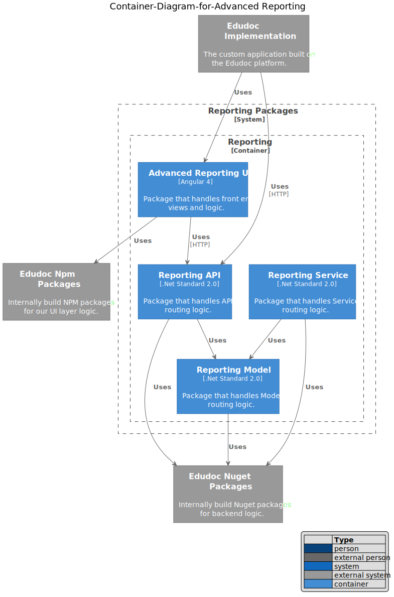

# Advanced Reporting Context

Advanced Reporting offers a bolt on package for advanced reporting scenarios.

The following features are added when you apply advanced reporting:

1. Ability to expose data sets to the users.
1. Users can configure custom reports.
1. Configuration options include:
    - Columns
    - Column order
    - Sort
    - Filters
    - Grouping
    - Aggregate data
1. Users can export their report data to CSV.
1. Users can manage sharing / edit access to their custom reports.

This feature is built with the goal of making implementing, managing and scaling the reporting infrastructure as easy as possible for our developers. Developers only need to configure the following:

1. Reporting Data points.
1. Custom display types.
1. DTO Maps from Model to Report data.

All other functionality including the UI elements, endpoints, models and service layers have been abstracted into the package.
